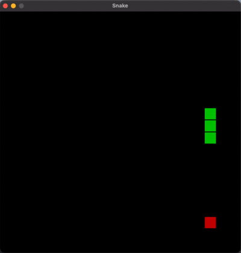

# snake-pygame

A classic Snake game built from scratch in Python using Pygame. No game engine, no abstractions just a game loop, a grid, and logic.

## How to Play

Use WASD to control the snake:
- W - up
- S - down
- A - left
- D - right

Eat the red food to grow and increase your score. Don't hit the walls or your own body. Game over screen shows your final score.

## Implementation

The game runs on a 20x20 grid with each cell being 30x30 pixels. The snake is stored as a list of `(x, y)` tuples representing grid coordinates, with the head at index 0.

Every frame:
1. Direction is updated from WASD input
2. New head position is computed by adding the direction vector to the current head
3. New head is inserted at the front of the snake list
4. If the head lands on food, score increments and tail is kept growing the snake by 1
5. Otherwise the tail is removed keeping length constant
6. Collision is checked against grid boundaries and the snake's own body (`new_head in snake[1:]`)
7. Grid is redrawn

Food spawn uses a rejection sampling loop regenerates until the position is not occupied by any snake segment.

Game speed is capped at 8 frames per second using `pygame.time.Clock`.

## Possible extensions

- Increasing speed as score grows
- High score persistence
- Obstacles
- Two player mode
- Wrap around walls instead of game over
